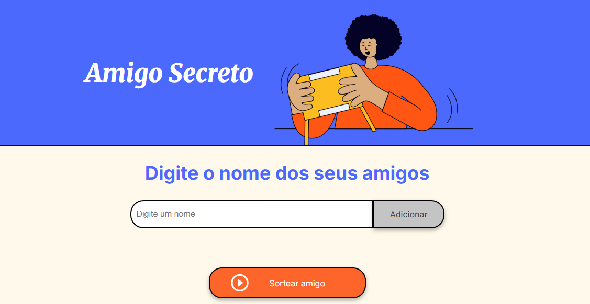

# 🎁 Amigo Secreto

Um sorteador simples de **Amigo Secreto** feito em **HTML, CSS e JavaScript**.  
Digite os nomes dos participantes, clique em **Sortear** e descubra quem será o amigo secreto da vez!  

---

## 🚀 Como usar
1. Clone este repositório ou baixe os arquivos.  
2. Abra o arquivo **index.html** no navegador.  
3. Digite os nomes dos amigos e clique em **Adicionar**.  
4. Clique em **Sortear amigo**.  

---

## 🛠️ Tecnologias usadas
- **HTML5** → estrutura da página  
- **CSS3** → estilização (cores, fontes e layout)  
- **JavaScript (ES6+)** → lógica para adicionar nomes e sortear  

---

## 📸 Prévia

---

## 📄 Licença
Este projeto é livre para estudo e pode ser adaptado como quiser.  

